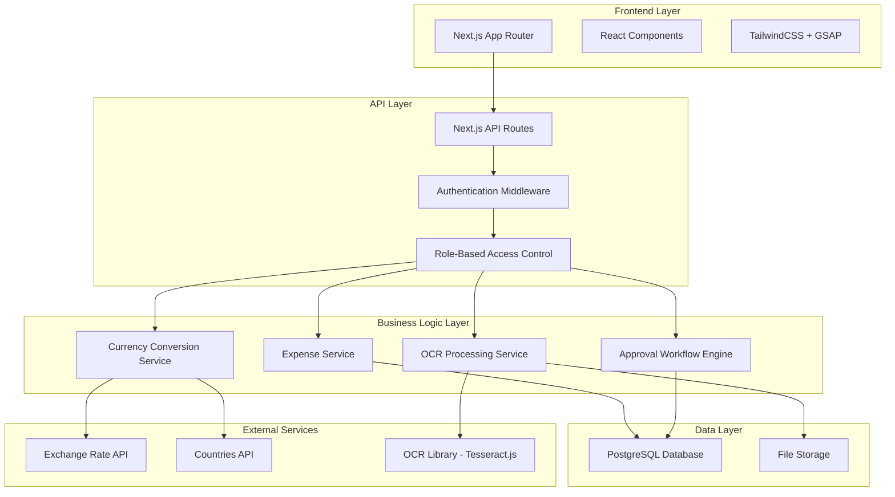
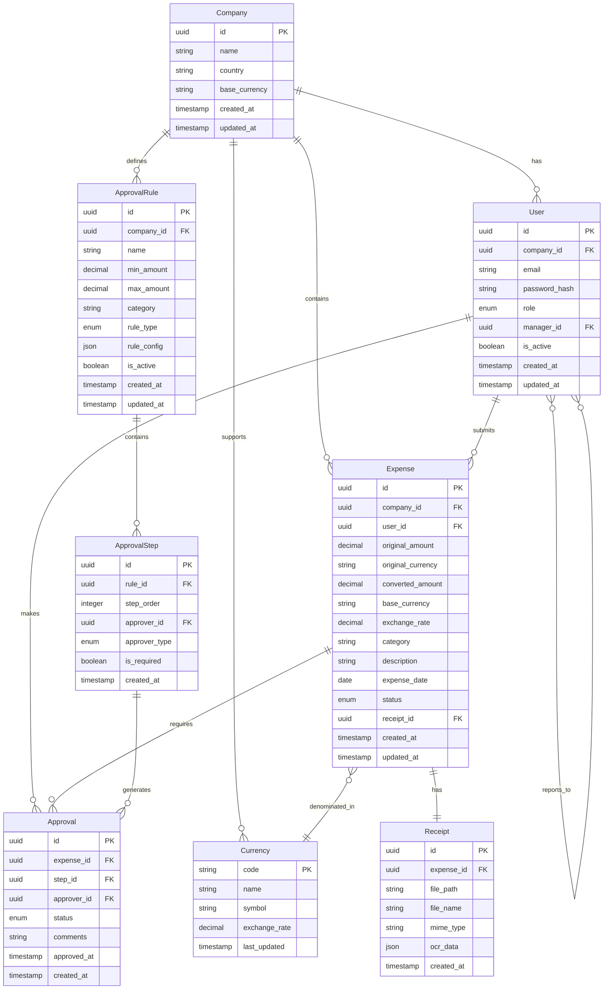

# Design Document

## Overview

The Expensio Smart Expense Management System is a full-stack web application built with Next.js, PostgreSQL, and TypeScript. The system implements a multi-tenant architecture where each company operates as an isolated tenant with role-based access control, automated approval workflows, and real-time currency conversion capabilities.

## Architecture

### High-Level Architecture



### Database Architecture

The system uses a multi-tenant approach with company-based data isolation:



## Components and Interfaces

### Frontend Components

#### 1. Authentication Components
- **LoginForm**: Handles user authentication with forget password and back to signup page and OAuth like google and robust validation.
- **SignupForm**: New user registration with company creation and unique company registration.
- **ProtectedRoute**: Route wrapper for authenticated access

#### 2. Dashboard Components
- **EmployeeDashboard**: Personal expense overview and submission of bills ,check expense history with total approved amounts and expense 
- **ManagerDashboard**: Team expenses and pending approvals,approval/reject history, 
- **AdminDashboard**: Company-wide analytics and management of approval,company expenses month and year wise. 

#### 3. Expense Management Components
- **ExpenseForm**: Multi-step expense submission with OCR
- **ExpenseList**: Filterable and sortable expense display
- **ExpenseDetail**: Detailed view with approval history
- **ReceiptUpload**: Drag-and-drop with OCR processing

#### 4. Approval Components
- **ApprovalQueue**: Pending approvals for managers
- **ApprovalHistory**: Timeline of approval decisions
- **ApprovalRuleBuilder**: Admin interface for workflow configuration

#### 5. Shared Components
- **Breadcrumb**: Navigation breadcrumb system
- **CurrencySelector**: Multi-currency input with conversion
- **LoadingSpinner**: Animated loading states with GSAP
- **Modal**: Reusable modal system
- **DataTable**: Sortable, filterable table component

### API Interfaces

#### Authentication Endpoints
```typescript
POST /api/auth/login
POST /api/auth/signup
POST /api/auth/logout
GET /api/auth/me
```

#### Expense Management Endpoints
```typescript
GET /api/expenses
POST /api/expenses
GET /api/expenses/[id]
PUT /api/expenses/[id]
DELETE /api/expenses/[id]
POST /api/expenses/[id]/    
POST /api/expenses/[id]/reject
```

#### User Management Endpoints
```typescript
GET /api/users
POST /api/users
GET /api/users/[id]
PUT /api/users/[id]
DELETE /api/users/[id]
```

#### Currency and External Data Endpoints
```typescript
GET /api/currencies
GET /api/currencies/rates
GET /api/countries
POST /api/ocr/process
```

### Service Layer Interfaces

#### ExpenseService
```typescript
interface ExpenseService {
  createExpense(data: CreateExpenseDto): Promise<Expense>
  updateExpense(id: string, data: UpdateExpenseDto): Promise<Expense>
  getExpensesByUser(userId: string): Promise<Expense[]>
  getExpensesByCompany(companyId: string): Promise<Expense[]>
  deleteExpense(id: string): Promise<void>
}
```

#### ApprovalWorkflowEngine
```typescript
interface ApprovalWorkflowEngine {
  initiateWorkflow(expenseId: string): Promise<ApprovalWorkflow>
  processApproval(approvalId: string, decision: ApprovalDecision): Promise<ApprovalResult>
  getNextApprovers(expenseId: string): Promise<User[]>
  checkWorkflowCompletion(expenseId: string): Promise<boolean>
}
```

#### CurrencyService
```typescript
interface CurrencyService {
  getExchangeRates(baseCurrency: string): Promise<ExchangeRates>
  convertAmount(amount: number, from: string, to: string): Promise<ConversionResult>
  getSupportedCurrencies(): Promise<Currency[]>
  updateExchangeRates(): Promise<void>
}
```

#### OCRService
```typescript
interface OCRService {
  processReceipt(file: File): Promise<OCRResult>
  extractExpenseData(ocrText: string): Promise<ExtractedExpenseData>
  validateExtractedData(data: ExtractedExpenseData): Promise<ValidationResult>
}
```

## Data Models

### Core TypeScript Interfaces

```typescript
interface Company {
  id: string
  name: string
  country: string
  baseCurrency: string
  createdAt: Date
  updatedAt: Date
}

interface User {
  id: string
  companyId: string
  email: string
  role: UserRole
  managerId?: string
  isActive: boolean
  createdAt: Date
  updatedAt: Date
}

enum UserRole {
  ADMIN = 'admin',
  MANAGER = 'manager',
  EMPLOYEE = 'employee'
}

interface Expense {
  id: string
  companyId: string
  userId: string
  originalAmount: number
  originalCurrency: string
  convertedAmount: number
  baseCurrency: string
  exchangeRate: number
  category: string
  description: string
  expenseDate: Date
  status: ExpenseStatus
  receiptId?: string
  createdAt: Date
  updatedAt: Date
}

enum ExpenseStatus {
  DRAFT = 'draft',
  SUBMITTED = 'submitted',
  PENDING_APPROVAL = 'pending_approval',
  APPROVED = 'approved',
  REJECTED = 'rejected',
  REIMBURSED = 'reimbursed'
}

interface ApprovalRule {
  id: string
  companyId: string
  name: string
  minAmount?: number
  maxAmount?: number
  category?: string
  ruleType: ApprovalRuleType
  ruleConfig: ApprovalRuleConfig
  isActive: boolean
}

enum ApprovalRuleType {
  PERCENTAGE = 'percentage',
  SPECIFIC_APPROVER = 'specific_approver',
  HYBRID = 'hybrid'
}

interface ApprovalRuleConfig {
  requiredPercentage?: number
  specificApprovers?: string[]
  hybridRules?: {
    percentage: number
    specificApprovers: string[]
  }
}
```

## Error Handling

### Error Types and Handling Strategy

#### 1. Authentication Errors
- **Unauthorized Access**: Return 401 with clear error message
- **Insufficient Permissions**: Return 403 with role requirements
- **Token Expiration**: Automatic refresh or redirect to login

#### 2. Validation Errors
- **Input Validation**: Return 400 with field-specific error messages
- **Business Rule Violations**: Return 422 with business context
- **File Upload Errors**: Return 413 for size limits, 415 for unsupported types

#### 3. External Service Errors
- **Currency API Failures**: Fallback to cached rates with staleness warning
- **OCR Processing Errors**: Allow manual entry with error notification
- **Database Connection Issues**: Retry logic with exponential backoff

#### 4. Error Response Format
```typescript
interface ErrorResponse {
  error: {
    code: string
    message: string
    details?: Record<string, any>
    timestamp: string
  }
}
```

### Error Boundaries and Recovery

- **React Error Boundaries**: Catch component errors and show fallback UI
- **API Error Interceptors**: Centralized error handling for API calls
- **Retry Mechanisms**: Automatic retry for transient failures
- **Graceful Degradation**: Core functionality remains available during partial failures

## Testing Strategy

### Unit Testing
- **Service Layer**: Test business logic with mocked dependencies
- **Utility Functions**: Test currency conversion, validation, and formatting
- **React Components**: Test component behavior with React Testing Library
- **API Routes**: Test endpoint logic with mocked database calls

### Integration Testing
- **Database Operations**: Test with test database instances
- **External API Integration**: Test with mock servers or test endpoints
- **Authentication Flow**: End-to-end authentication testing
- **File Upload and OCR**: Test complete upload and processing pipeline

### End-to-End Testing
- **User Workflows**: Complete expense submission and approval flows
- **Role-Based Access**: Verify proper access control across user types
- **Multi-Currency Operations**: Test currency conversion and display
- **Responsive Design**: Test across different screen sizes and devices

### Performance Testing
- **Database Query Optimization**: Monitor and optimize slow queries
- **File Upload Performance**: Test large file handling and processing
- **Concurrent User Load**: Test system behavior under load
- **API Response Times**: Monitor and optimize endpoint performance

## Security Considerations

### Authentication and Authorization
- **JWT Tokens**: Secure token-based authentication with refresh tokens
- **Role-Based Access Control**: Middleware-enforced permission checking
- **Session Management**: Secure session handling with proper expiration
- **Password Security**: Bcrypt hashing with appropriate salt rounds

### Data Protection
- **Input Sanitization**: Prevent XSS and injection attacks
- **File Upload Security**: Virus scanning and type validation
- **Database Security**: Parameterized queries to prevent SQL injection
- **Sensitive Data**: Encryption of sensitive fields at rest

### API Security
- **Rate Limiting**: Prevent abuse with request rate limiting
- **CORS Configuration**: Proper cross-origin resource sharing setup
- **Request Validation**: Comprehensive input validation on all endpoints
- **Error Information**: Avoid exposing sensitive system information in errors

## Deployment and Scalability

### Infrastructure Requirements
- **Database**: PostgreSQL with connection pooling
- **File Storage**: Cloud storage for receipt files with CDN
- **Caching**: Redis for session storage and API response caching
- **Monitoring**: Application performance monitoring and logging

### Scalability Considerations
- **Database Indexing**: Optimize queries with proper indexing strategy
- **Horizontal Scaling**: Design for multiple application instances
- **Caching Strategy**: Implement multi-level caching for performance
- **Background Jobs**: Queue system for OCR processing and email notifications